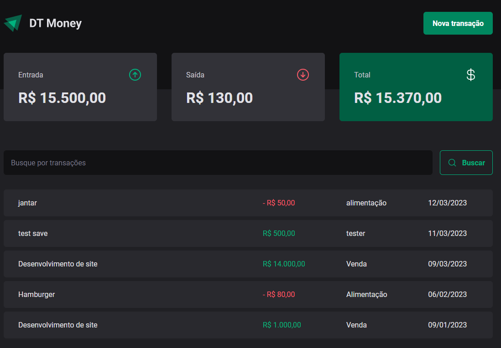
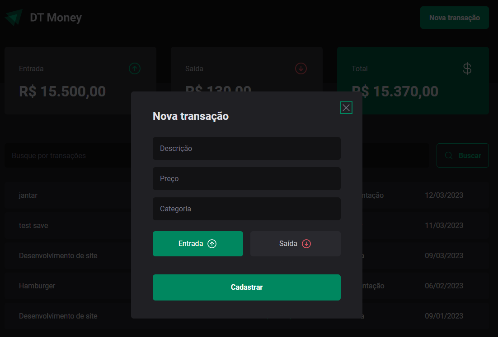

# Projeto 3 - React Js - Ignite Rockeseat

Uma aplicação frontend Web completa para controle de entrada e saída movimentação financeira, conectando a uma API e efetuado aplicações de performace no fluxo de renderização de componentes através de (useCallback, Memo, useMemo,...).

## Ver Projeto

<a href="https://moneycontrol-rho.vercel.app/">
<p>Link do Projeto</p>
</a>

## Screenshot

<p align="center">Tela inicial</p>

<p align="center">Formulário transação</p>


## Licença

[](https://choosealicense.com/licenses/mit/)

## Clonar repositório

Clone do projeto

```bash
  git clone https://github.com/Jtomio/react-control-money
```

Abra a diretório no prompt

```bash
  cd rreact-control-money
```

Instale dependências

```bash
  npm install
```

iniciar web

```bash
  npm run dev
```

iniciar server

```bash
  npm run dev:server
```

## Autor

- Jeison Tomio
- [@Jtomio](https://www.github.com/Jtomio)

## 🔗 Links

[](https://portfoliojeison.vercel.app/)

[](https://www.linkedin.com/in/jeison-tomio/)
